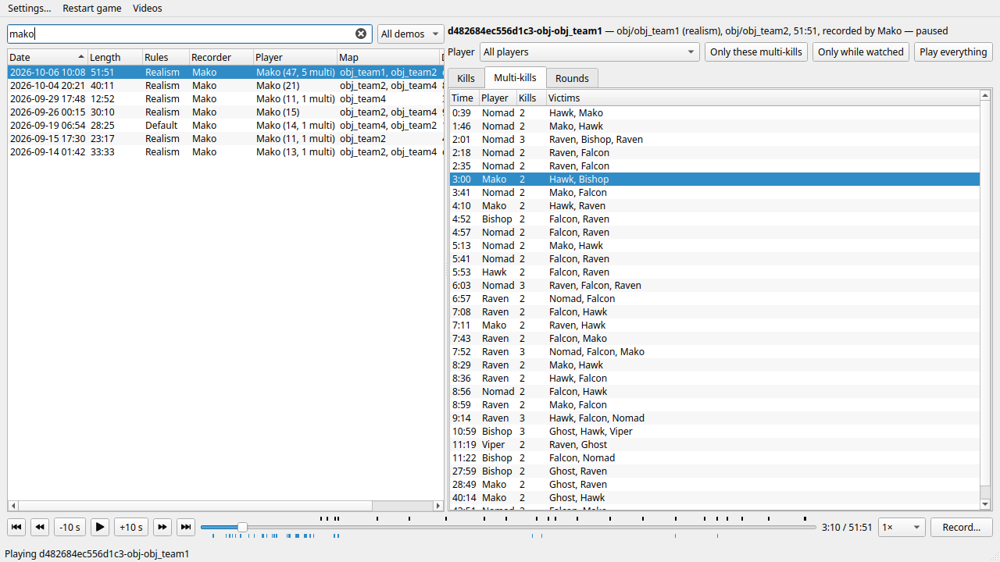

# MoH Demo Replay

Rewatch and record **Medal of Honor: Allied Assault** multiplayer demos. A
small desktop app lists your demos and what happens in them (kills,
multi-kills, rounds), jumps straight to any moment, and records MP4 videos
with sound. It runs on a modified [OpenMoHAA](https://github.com/openmoh/openmohaa),
the open-source engine for the game, which does the work through new console
commands.



*The demos where Mako plays, and the multi-kills of the one playing. The
player names are made up.*

## What it does

- **Find demos.** The list shows each demo's date, length, levels and
  rules: default or realism servers, told apart by how fast the recorder
  runs with each weapon. Show only default or realism demos, and filter by
  demo name, level or player: type a name to see every demo that player is
  in, with their kills and multi-kills.
- **Move around a demo.** Its kills, multi-kills and rounds are listed and
  marked on the time slider. A click jumps there, 4 seconds before a kill.
  Pause, skip 10 seconds, go to the next or previous kill or round, play
  from 0.25× to 4×.
- **Watch only what matters.** Play only the kills or multi-kills, of
  everyone or of one player, or only while a player is watched. The rest is
  skipped.
- **Record videos.** MP4 with sound, at the size and frame rate you choose,
  recorded in the background faster than real time while you keep watching.
  Record a stretch of time, the kills or multi-kills, the kills you select,
  or a player's kills across many demos, in one video or one each. Videos
  wait in a queue.
- **No app needed.** Everything is a game console command (`demoseek`,
  `demonextkill`, `demoonly`, `demovideo`…), so it all works with key binds
  too.

A multi-kill is two kills or more by one player, each at most 3 seconds
after the one before.

## Requirements

- Linux (Wayland or X11) or macOS. Not Windows: the app talks to the game
  through a named pipe, which the game only has on Unix-like systems.
- The game files of Medal of Honor: Allied Assault (the folder with
  `main/Pak0.pk3`), and the files of any custom map the demos use.
- Allied Assault demos (`.dm3`), recorded while playing or spectating.
  Spearhead and Breakthrough demos aren't supported.
- Python 3 and PySide6 for the app, FFmpeg to record.
- To build the game: CMake 3.25 or later, Ninja, a C++ compiler, Flex,
  Bison, SDL2 and OpenAL Soft.

On Ubuntu or Debian:

```bash
sudo apt install cmake ninja-build g++ flex bison libsdl2-dev libopenal-dev python3-pyside6.qtcore python3-pyside6.qtgui python3-pyside6.qtwidgets ffmpeg
```

## Build

```bash
git clone https://github.com/pstngh/mohdemo-replay
cd mohdemo-replay
cmake -B .cmake -G Ninja -DCMAKE_BUILD_TYPE=RelWithDebInfo -DBUILD_SERVER=OFF
cmake --build .cmake
```

This makes the game (`openmohaa`) and the demo indexer (`mohdemoindex`) in
`.cmake/RelWithDebInfo`, where the app looks for them. The sound of videos
needs OpenAL Soft, the OpenAL of Linux distributions.

macOS builds in CI but hasn't been tried on a Mac yet:
[shared-build-macos.yml](.github/workflows/shared-build-macos.yml) shows
how it builds there, with OpenAL Soft.

## Run

```bash
python3 replay/mohreplay.py
```

The first time, Settings asks for the game program (found by itself in
`.cmake/RelWithDebInfo`), the game files folder and the demos folder. The
demos are then indexed in the background, once: about two minutes for 700.
Double-click a demo to play it. The game plays it in its own window next to
the app; Wayland doesn't let one program show another's window inside its
own.

The folders can also be given on the command line, with a demo to play:

```bash
python3 replay/mohreplay.py --exe PATH --game FOLDER --demos FOLDER DEMO
```

In the game window, letters and numbers stop a demo, so the app binds other
keys:

| Key | Does |
| --- | --- |
| Pause | pause or play |
| Left / Right | back or forward 5 seconds |
| Down / Up | previous or next kill |
| PgDn / PgUp | previous or next round |

[replay/README.md](replay/README.md) has the details of the app, the console
commands and their settings, and recording.

## How it works

- The app starts the game with a throwaway home folder, sends it console
  commands through a pipe (`com_pipefile`) and shows what the game reports
  in two files, `demostate.json` and `demoindex.json`. It never waits on the
  game, and copes with it quitting or crashing.
- A demo only plays forward, so going back replays it from the start
  without drawing, up to the exact time asked.
- `mohdemoindex` reads a demo the way the game does and lists its kills,
  rounds, levels and who is watched when, without game files. The app keeps
  the indexes in `~/.cache/mohdemo-replay` until the demo or `mohdemoindex`
  changes.
- A second copy of the game records, without a window on Linux. It steps
  exactly one frame time per frame and pipes the frames to FFmpeg, and
  OpenAL Soft renders the sound for each frame, so the video stays smooth
  and in sync however fast it's made.

[PLAN.md](PLAN.md) has the decisions behind it and how it was built.

## Tests

```bash
python3 replay/tests/test_mohreplay.py
```

The app's tests run against a fake game, so they need neither game files
nor a screen. With `MOHREPLAY_TEST_GAME` (the game files folder) and
`MOHREPLAY_TEST_DEMOS` (a folder of demos) set, they also play and record a
real demo with the game built in `.cmake`. `ctest` in `.cmake` runs them
with the engine's tests; the demo index is checked on real demos with
`DEMOINDEX_TEST_DEMOS` set to a folder of them.

## Credits and license

Built on [OpenMoHAA](https://github.com/openmoh/openmohaa), itself built on
[ioquake3](https://github.com/ioquake/ioq3) and the F.A.K.K SDK. For the
game itself (installing it, playing online, running a server), see
OpenMoHAA and the [documentation](docs/markdown) kept from it.

GPL-2.0, see [COPYING.txt](COPYING.txt). Not affiliated with or endorsed by
Electronic Arts.
